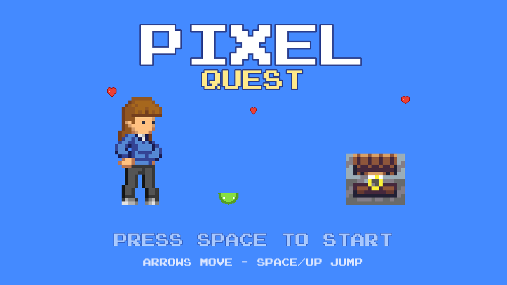
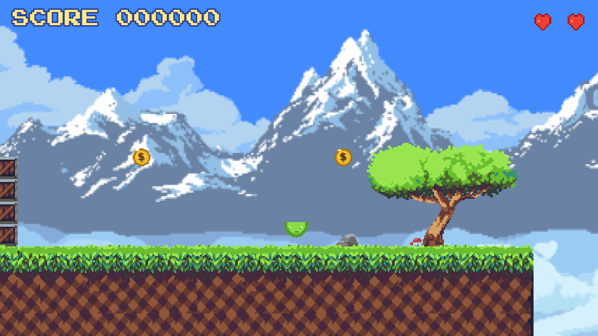
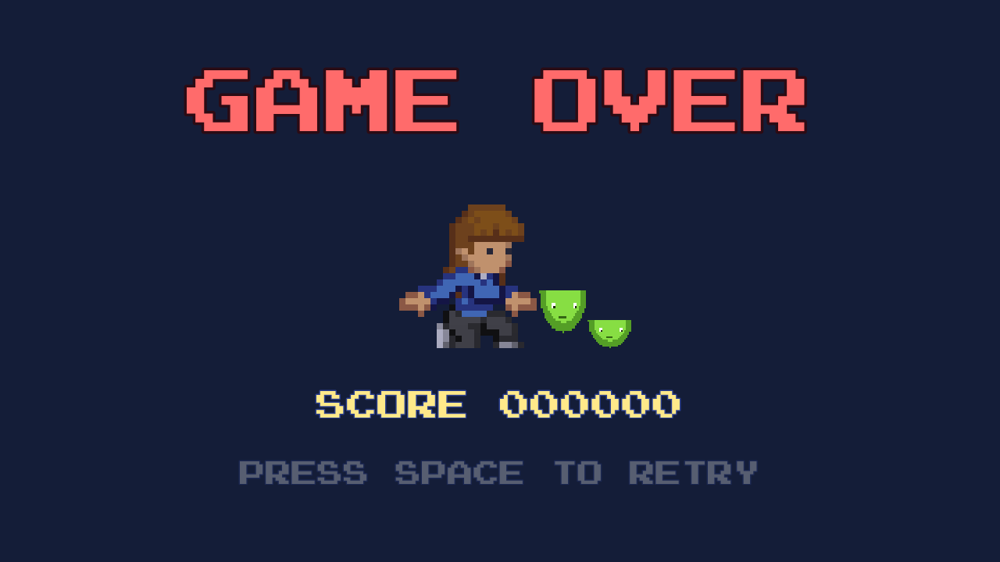
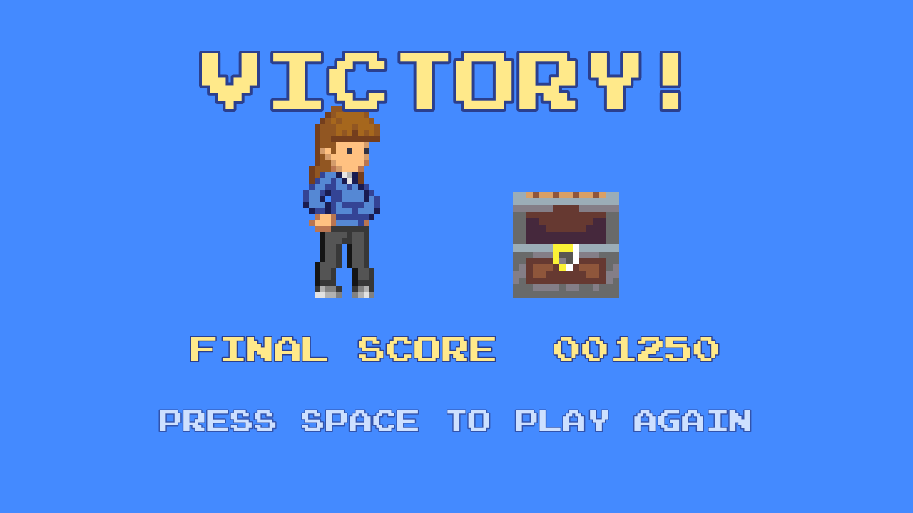

# PIXEL QUEST 🎮

> **A Contemporary Browser-Based 2D Platformer Game Built with HTML5, TypeScript, and Phaser 3.**  
> Developed for **Multimedia Application (CMM21103)** — Management & Science University (MSU), July 2026 Semester.

---

## 🌟 Overview

**Pixel Quest** is a complete, install-free 2D platformer web application where players guide the hero **Ara** across a hand-crafted pixel-art environment: collecting coins, jumping on slimes, dodging hazards, and unsealing the **Love Chest** to complete the quest.

Built entirely using modern open web technologies (Phaser 3.16 + TypeScript + WebAssembly/WebGL), **Pixel Quest** delivers zero-friction gameplay across both desktop laptops and mobile touchscreens without requiring any store installation or plugin download.

---

## 📸 Screenshots & Showcase

| **Title Screen (Live Showcase)** | **Gameplay & Combat** |
| :---: | :---: |
|  |  |
| *Animated title screen featuring Ara, hopping slimes, and floating hearts* | *Real-time physics, score tracking, coins, and enemy chase AI* |

| **Game Over Scene** | **Victory Celebration** |
| :---: | :---: |
|  |  |
| *Retro styled game-over stage with defeated Ara & mocking slimes* | *Celebratory stage with open Love Chest & heart particle fireworks* |

---

## ✨ Key Features & Mechanics

- 🎨 **Five Integrated Multimedia Elements**
  - **Graphics:** Pixel-art hero (Ara), 3 slime variants, minted coins, Love Chest, tilemap terrain, and 3-layer parallax skies.
  - **Animation:** Walk/jump/fall sprite states, coin spins, hopping slimes, chest opening, and heart particle bursts.
  - **Audio:** Loopable chiptune BGM playlist + 6 distinct event-driven chiptune SFX (jump, coin, stomp, hurt, game over, victory).
  - **Text:** Arcade-style font rendering for HUD, banners, prompts, and score displays.
  - **Interactivity:** Arcade physics, enemy perception AI, dual input (Keyboard + Touch), and persistent game state.

- 👾 **Emergent Slime Split System**
  - Stomping a **Big Slime** (+50 pts) triggers a split into **3 Mini Slimes** that scatter in a fan pattern. Minis are faster, smaller, and relentlessly chase the player!

- 🧰 **Stomp-to-Open Goal Finale**
  - The quest culminates at the **Love Chest**. Players must land ON TOP of the chest (reusing the jump/stomp mechanic) to trigger the level victory and celebratory fireworks.

- 🎯 **Fair-Play Stomp Mechanics**
  - Frame-aware landing evaluation: stomp credit is never swallowed by invincibility frames, and fall speed tolerance ensures clean head-stomps are always rewarded fairly.

- 📱 **Cross-Device Responsive Design**
  - Fully responsive WebGL/Canvas layout that scales gracefully from desktop monitors to mobile touchscreens with dedicated touch-zone controls.

---

## 🕹️ Controls

| Action | Desktop Controls | Mobile Touch Controls |
| :--- | :--- | :--- |
| **Move Left / Right** | `Left Arrow` / `Right Arrow` or `A` / `D` | Touch Left / Right third of screen |
| **Jump** | `Space` / `Up Arrow` or `W` | Touch Top third of screen |
| **Start / Retry** | `Space` / `Enter` | Tap Anywhere on screen |

---

## 🛠️ Tech Stack & Architecture

- **Game Engine:** [Phaser 3.16](https://phaser.io/) (Arcade Physics, Scene Manager, Emitters)
- **Language:** [TypeScript](https://www.typescriptlang.org/) (Strictly typed game logic across 29 modules)
- **Bundler:** [Webpack 5](https://webpack.js.org/) (Hashed production bundles, production minification)
- **Level Design:** [Tiled Map Editor](https://www.mapeditor.org/) (Extruded 16x16 tilemap layers & object placement)
- **Web Server & Hosting:** Apache2 + Cloudflare Tunnel (HTTPS cloud delivery with cache-revalidation headers)
- **Testing:** Playwright Headless Automation (10/10 feature regression test suite)

---

## 📁 Repository Structure

```text
CMM20103202607001/
├── docs/                      # Documentation artifacts & PRD specifications
├── src/
│   ├── assets/                # Audio, fonts, icons, sprites, and tilemaps
│   ├── components/            # Reusable UI & map components (Hud, Dialog, Sfx, Chest)
│   ├── entities/              # Physics entities (Player, Enemy, Coin)
│   ├── scenes/                # Phaser scenes (TitleScene, MainScene, GameOverScene, WinScene)
│   ├── utils/                 # Input helpers, touch detectors, and device utilities
│   ├── favicon.ico            # Pixel-art heart favicon
│   ├── game.ts                # Application entry point & Phaser configuration
│   └── index.ejs              # Main HTML template with anti-cache & PWA headers
├── webpack/                   # Webpack development and production configs
├── package.json               # Project dependencies & npm scripts
└── README.md                  # Project documentation
```

---

## 🚀 Getting Started

### 1. Clone the repository
```bash
git clone https://github.com/HakimIqbal/CMM20103202607001.git
cd CMM20103202607001
```

### 2. Install dependencies
```bash
npm install
```

### 3. Run in Development Mode
```bash
npm start
```
Open your browser and navigate to `http://localhost:8080`.

### 4. Build for Production
```bash
npm run build
```
The optimized production bundle will be generated under the `dist/` directory.

---

## 🎓 Academic Information

- **Course:** Multimedia Application
- **Course Code:** CMM21103
- **Degree Program:** Bachelor / Diploma in Multimedia
- **Institution:** Management & Science University (MSU)
- **Semester:** July 2026
- **Lecturers:** Izzul Iman Bin Suhairi & Muhammad Rohaizad Bin Zainun

---

*Developed for the Final Project requirement in CMM21103.*
